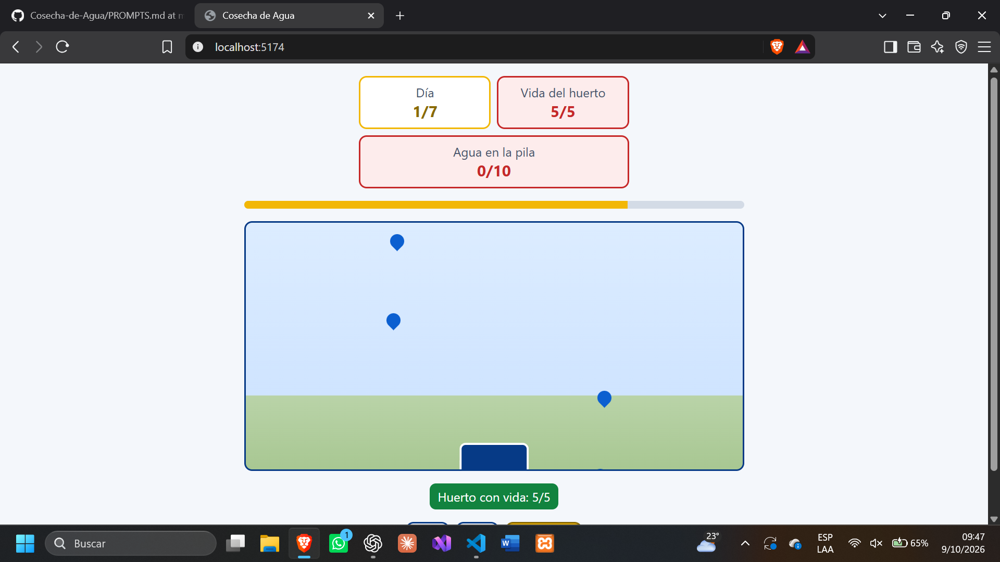
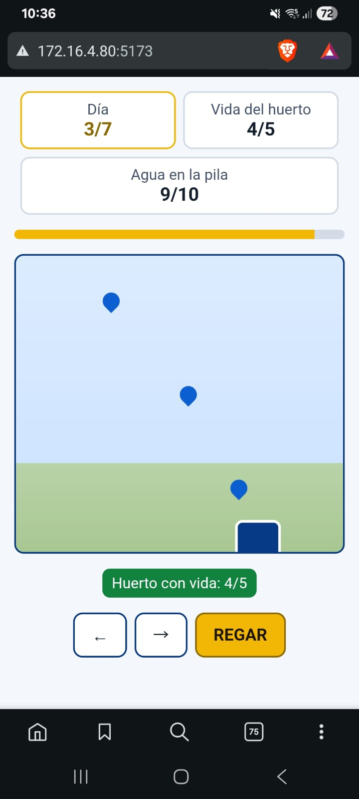

# Cosecha de Agua

## 1. Nombre y frase de la ficha

**Cosecha de Agua** es un juego donde atrapo gotas de lluvia con una pila y decido cuándo gastar el agua para mantener vivo mi huerto durante la época seca.

## 2. Qué hace y cómo se usa

Mueve la pila para atrapar las gotas y juntar agua.  
Usa las flechas del teclado o arrastra la pila con el dedo en el área de juego.  
Riega con el botón **REGAR** o la barra espaciadora para conservar la vida del huerto.

## 3. Enlace para abrirlo

- **Repositorio de GitHub:** [Cosecha-de-Agua](https://github.com/cristopheredgardo13-prog/Cosecha-de-Agua)
- **Juego publicado:** pendiente de publicar. Agrega aquí la dirección pública cuando el despliegue termine y la hayas abierto correctamente.

## 4. Cómo ejecutarlo en otra computadora

Se necesita Node.js y npm instalados. Desde la carpeta del proyecto, ejecuta:

```bash
npm install
npm run dev
```

Para comprobar las pruebas y crear la versión de producción:

```bash
npm test
npm run build
```

## 5. Qué dirigí yo y qué error encontré probando

<!-- Completa esta parte con tus propias palabras después de probar el juego. Escribe qué instrucciones diste y un error real que encontraste, si hubo alguno. -->

**Qué dirigí yo:** [Completar personalmente.]  
**Qué error encontré al probar:** [Completar personalmente; si no encontraste ninguno, dilo con sinceridad.]

## 6. Declaración de autoría

**Herramientas usadas:** OpenCode, GitHub Copilot en Visual Studio Code y ChatGPT para orientación y revisión.

El código fue generado y ajustado con ayuda de agentes de inteligencia artificial bajo mi dirección. Revisé el proyecto por etapas y debo poder explicar las partes que entregue.

**Partes del programa que puedo explicar:** [Completar personalmente con las partes que realmente comprendes, por ejemplo, las reglas de `src/logica.ts`, los controles o las pruebas.]

## Evidencias de los avances

Guarda cada captura dentro de `capturas/` y reemplaza o conserva la referencia correspondiente. No dejes una imagen como evidencia hasta haber tomado esa captura real.

### Avance 1: lógica y compilación

Captura la terminal con la compilación de TypeScript sin errores y guárdala como `capturas/01-logica.png`.


### Avance 2: pruebas

Captura la terminal con las pruebas en verde y guárdala como `capturas/02-pruebas.png`.


### Avance 3: juego en la computadora

Captura el juego en funcionamiento en el navegador y guárdala como `capturas/03-juego.png`.



### Avance 4: prueba en el celular

Después de probar el juego en un teléfono real, captura la pantalla y guárdala como `capturas/04-celular.png`.



### Avance 5: publicación

Cuando publiques el juego y confirmes que abre desde el teléfono con datos móviles, captura la página y guárdala como `capturas/05-publicado.png`.


